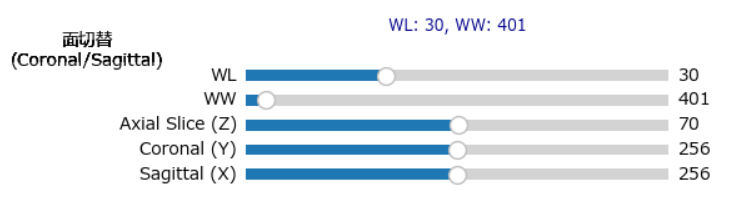
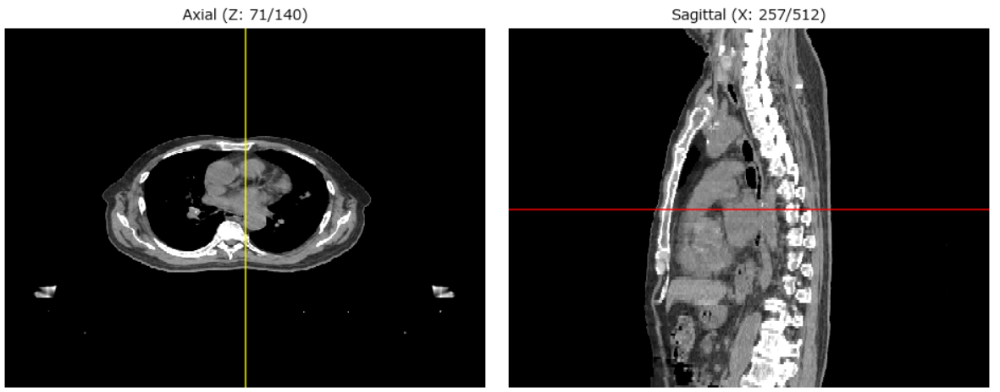

## 知能情報実験実習２ — DICOM Viewer (viwer.py) 操作マニュアル

このリポジトリに含まれる `実験課題/viwer.py` は、Windows 上で動作するシンプルな DICOM ビューア（GUI）です。
本 README は予備知識が無くてもアプリを起動・操作できるように、環境構築、実行手順、GUI の各コントロール（スライダやボタン）が画像に対してどう作用するか、どのように調整すれば目的の画像が得られるかを詳しく記載します。

---

## 目次
- 概要
- 必要なもの（前提）
- 環境構築（Windows / PowerShell 向け）
- 実行方法
- GUI 操作マニュアル（各スライダ／ボタンの詳しい説明と調整例）
- スクリーンショット（どのような写真を撮って README に貼るかの指示）
- トラブルシューティング

## 概要
- `viwer.py` は、指定したフォルダ内の DICOM 画像系列を読み込み 3D ボリュームとして扱い、以下の表示を提供します:
  - 左パネル: Axial（横断面）
  - 右パネル: Coronal（冠状面）または Sagittal（矢状面）を切替表示
  - 下部: WL/WW（Window Level / Window Width）と Z/Y/X のスライダ、面切替ボタン

GUI は Matplotlib と Tkinter を使って作られています（外部ウィンドウで Matplotlib のインタラクティブウィンドウが開きます）。

## 必要なもの（前提）
- OS: Windows（本マニュアルは Windows + PowerShell を想定しています）
- Python: 3.8 以上推奨
- インターネット接続（パッケージのインストール用）

特殊なハードウェアや商用ソフトは不要です。Tkinter は標準 Python に含まれることが多く、別途インストール不要なことが一般的です。

## 環境構築（Windows, PowerShell 手順）
1. Python がインストールされているか確認します。PowerShell を開き、次を実行してください:

```powershell
python --version
```

2. Python がインストールされていない場合は、公式サイト（https://www.python.org/）から Python をインストールしてください。インストーラで「Add Python to PATH」をチェックすることを推奨します。

3. 必要な Python パッケージをインストールします。PowerShell で次を実行してください:

```powershell
python -m pip install --upgrade pip --user
python -m pip install pydicom numpy matplotlib --user
```

注: `tkinter` は通常 Python に同梱されています。万が一 Tk が無いエラーが出たら、Python のインストールオプションに Tk サポートを追加するか、Windows 用の Python を再インストールしてください。

## 実行方法
1. エクスプローラや PowerShell でリポジトリのルート（この README がある場所）に移動します。

```powershell
cd "C:\Users\<あなたのユーザ名>\デスクトップ\知能情報実験実習２後期"
```

2. スクリプトを起動します（ファイル名は `viwer.py` です）：

```powershell
python .\実験課題\viwer.py
```

3. 小さい Tk ウィンドウ（ランチャ）が開きます。「DICOMフォルダを開く」をクリックして、DICOM 画像群（連続したスライスファイル）を格納したフォルダを選択してください。2枚目の写真はフォルダ選択後の全体画面で、ここで操作を行っていきます。


4. 読み込みが成功すると Matplotlib のウィンドウが開きます。左が Axial（横断面）、右が Coronal（初期）です。下部に WL/WW、Z/Y/X スライダがあります。
また、coronalとsagittalの切替ボタンがスライダの横に置かれています。


## GUI 操作マニュアル — 各部の説明と具体的な調整例

この節は「どのスライダを動かすと画像がどう変わるか」「どういった画像を表示させたいときに何をどう調整すれば良いか」を具体的に書いたものです。実際に試しながら操作してください。

### メイン要素
- Axial（左パネル）: 原画像系列の横断面（Z スライス）。
- Secondary（右パネル）: Coronal（冠状面）または Sagittal（矢状面）。面切替ボタンで切替。
- WL（Window Level）スライダ: 画像の明るさの中心値を調整します（上げると明るく、下げると暗く）。
- WW（Window Width）スライダ: コントラストの幅を調整します（小さくするとコントラスト高、広くすると低）。
- Axial Slice (Z) スライダ: Axial 面のスライス番号を選択します（整数）。
- Coronal (Y) スライダ: Coronal を表示するための Y インデックス（Coronal 表示時に有効）。Axial 上の緑色の横線が位置を示します。

- Sagittal (X) スライダ: Sagittal を表示するための X インデックス（Sagittal 表示時に有効）。Axial 上の黄色の縦線が位置を示します。

- 面切替ボタン: 右パネルを Coronal と Sagittal の間で切替えます。切替に応じて有効なスライダが変わります。

### 参照線の見方
- Axial 上の緑（lime）の横線: Coronal の位置（Y）を示します。
- Axial 上の黄色の縦線: Sagittal の位置（X）を示します。
- Secondary 上の赤（red）の横線: 現在の Axial（Z）位置を示します。

---