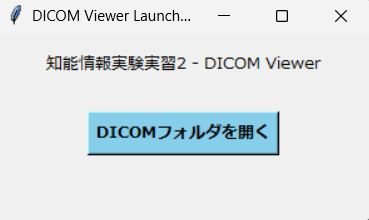

## 知能情報実験実習２ — DICOM Viewer (viwer.py) 操作マニュアル

このリポジトリに含まれる `実験課題/viwer.py` は、Windows 上で動作するシンプルな DICOM ビューア（GUI）です。
本 README は予備知識が無くてもアプリを起動・操作できるように、環境構築、実行手順、GUI の各コントロール（スライダやボタン）が画像に対してどう作用するか、どのように調整すれば目的の画像が得られるかを詳しく記載します。

---

## 目次
- 概要
- 必要なもの（前提）
- 環境構築（Windows / PowerShell 向け）
- 実行方法
- GUI 操作マニュアル（各スライダ／ボタンの詳しい説明と調整例）
- スクリーンショット（どのような写真を撮って README に貼るかの指示）
- トラブルシューティング

## 概要
- `viwer.py` は、指定したフォルダ内の DICOM 画像系列を読み込み 3D ボリュームとして扱い、以下の表示を提供します:
  - 左パネル: Axial（横断面）
  - 右パネル: Coronal（冠状面）または Sagittal（矢状面）を切替表示
  - 下部: WL/WW（Window Level / Window Width）と Z/Y/X のスライダ、面切替ボタン

GUI は Matplotlib と Tkinter を使って作られています（外部ウィンドウで Matplotlib のインタラクティブウィンドウが開きます）。

## 必要なもの（前提）
- OS: Windows（本マニュアルは Windows + PowerShell を想定しています）
- Python: 3.8 以上推奨
- インターネット接続（パッケージのインストール用）

特殊なハードウェアや商用ソフトは不要です。Tkinter は標準 Python に含まれることが多く、別途インストール不要なことが一般的です。

## 環境構築（Windows, PowerShell 手順）
1. Python がインストールされているか確認します。PowerShell を開き、次を実行してください:

```powershell
python --version
```

2. Python がインストールされていない場合は、公式サイト（https://www.python.org/）から Python をインストールしてください。インストーラで「Add Python to PATH」をチェックすることを推奨します。

3. 必要な Python パッケージをインストールします。PowerShell で次を実行してください:

```powershell
python -m pip install --upgrade pip --user
python -m pip install pydicom numpy matplotlib --user
```

注: `tkinter` は通常 Python に同梱されています。万が一 Tk が無いエラーが出たら、Python のインストールオプションに Tk サポートを追加するか、Windows 用の Python を再インストールしてください。

## 実行方法
1. エクスプローラや PowerShell でリポジトリのルート（この README がある場所）に移動します。

```powershell
cd "C:\Users\<あなたのユーザ名>\デスクトップ\知能情報実験実習２後期"
```

2. スクリプトを起動します（ファイル名は `viwer.py` です）：

```powershell
python .\実験課題\viwer.py
```

3. 小さい Tk ウィンドウ（ランチャ）が開きます。「DICOMフォルダを開く」をクリックして、DICOM 画像群（連続したスライスファイル）を格納したフォルダを選択してください。

4. 読み込みが成功すると Matplotlib のウィンドウが開きます。左が Axial（横断面）、右が Coronal（初期）です。下部に WL/WW、Z/Y/X スライダと面切替ボタンがあります。

## GUI 操作マニュアル — 各部の説明と具体的な調整例

この節は「どのスライダを動かすと画像がどう変わるか」「どういった画像を表示させたいときに何をどう調整すれば良いか」を具体的に書いたものです。実際に試しながら操作してください。

### メイン要素
- Axial（左パネル）: 原画像系列の横断面（Z スライス）。
- Secondary（右パネル）: Coronal（冠状面）または Sagittal（矢状面）。面切替ボタンで切替。
- WL（Window Level）スライダ: 画像の明るさの中心値を調整します（上げると明るく、下げると暗く）。
- WW（Window Width）スライダ: コントラストの幅を調整します（小さくするとコントラスト高、広くすると低）。
- Axial Slice (Z) スライダ: Axial 面のスライス番号を選択します（整数）。
- Coronal (Y) スライダ: Coronal を表示するための Y インデックス（Coronal 表示時に有効）。Axial 上の緑色の横線が位置を示します。
- Sagittal (X) スライダ: Sagittal を表示するための X インデックス（Sagittal 表示時に有効）。Axial 上の黄色の縦線が位置を示します。
- 面切替ボタン: 右パネルを Coronal と Sagittal の間で切替えます。切替に応じて有効なスライダが変わります。

### 参照線の見方
- Axial 上の緑（lime）の横線: Coronal の位置（Y）を示します。
- Axial 上の黄色の縦線: Sagittal の位置（X）を示します。
- Secondary 上の赤（red）の横線: 現在の Axial（Z）位置を示します。

### よくある観察目的と推奨 WL/WW（目安）
- 軟部組織（臓器）:
  - WL: 30〜60, WW: 300〜500
  - 操作: WL/WW を上の目安に合わせ、Z スライダで関心部位に移動。

- 肺野（空気・肺実質）:
  - WL: -600, WW: 1200〜1600
  - 操作: WL を負にして肺の低吸収部位を見やすくし、WW を広めに設定。

- 骨（高吸収領域）:
  - WL: 200〜500, WW: 1000〜2500
  - 操作: WW を広めに設定し、右パネルを Sagittal に切替えて縦断面で骨の走行を確認。

具体例（背骨確認）:
1. 面切替ボタンで右パネルを `Sagittal` にする。
2. X スライダで脊柱の中央付近に移動（Axial 上の黄色線で位置確認）。
3. WL/WW を (WL=350, WW=2000) のように設定して骨を強調。

### スライダの操作ヒント
- まず WL を小刻みに動かして好みの明るさを見つけ、その後 WW を調整してコントラストの鋭さを決定します。
- WW を極端に小さくするとノイズが目立つ点に注意。

## スクリーンショット（README に貼るための具体的指示）

以下のスクリーンショットを `images/` フォルダに用意すると分かりやすいドキュメントになります。ファイル名は示した通りに保存してください。

1. `images/01_launcher.png` — ランチャ（Tk の小ウィンドウ）全体（"DICOMフォルダを開く" ボタンが見える）
2. `images/02_axial_default.png` — 起動直後の Axial（左） / Coronal（右）表示（スライダが見える全体画面）
3. `images/03_wl_ww_soft_tissue.png` — 軟部組織表示の WL/WW 設定例（WL=50, WW=400 など）
4. `images/04_wl_ww_bone.png` — 骨表示（Sagittal に切替、WL=350, WW=2000 など）
5. `images/05_coronal_with_lines.png` — Coronal 表示と参照線（Axial の緑線・Secondary の赤線が見える）
6. `images/06_slice_navigation.png` — Z スライダを動かしたときのスライス移動例（スライダ位置とスライス表示が対応していることが分かるもの）

撮影手順（Windows の例）:
- Snip & Sketch（Windows 標準）や PrintScreen を使って画面を撮影し、`images/` フォルダに PNG で保存してください。

README への挿入例:

```markdown

_図 1: DICOM Viewer ランチャ画面_
```

## トラブルシューティング
- フォルダに有効な DICOM がない場合
  - 選んだフォルダに `.dcm` ファイルが含まれているか確認してください。拡張子の無い DICOM ファイルや特殊フォーマットの場合もあります。

- Tkinter が見つからない / Tk エラーが出る場合
  - Python を再インストールし、Tk サポートを有効にしてください（Windows の公式インストーラを推奨）。

- pydicom が読み取れないファイルが混在している場合
  - 破損ファイルや非画像の DICOM が紛れている可能性があります。問題のファイルを別のフォルダに移して再実行してください。

## 付録（開発者向けメモ）
- 使用ライブラリ: `pydicom`, `numpy`, `matplotlib`, `tkinter`
- スクリプト: `実験課題/viwer.py`（ファイル名は `viwer.py` です。スペルに注意してください）
- 改良案: WL/WW のプリセットボタン（軟部／肺／骨）を追加すると使いやすさが向上します。希望があれば実装します。

---

もし README に実際のスクリーンショットを埋め込んでほしい場合は、あなたの環境で `viwer.py` を起動して得られた PNG ファイルをここにアップロードするか、保存場所とファイル名を教えてください。私の方で README の該当箇所に画像挿入用の Markdown を追記します。
# 🩺 DICOM 3D ビューア操作マニュアル

## 概要

本アプリケーションは、Pythonと`matplotlib`、`pydicom`ライブラリを使用して作成された**DICOM 3D ビューア**です。CTやMRIなどのDICOM画像系列（フォルダ）を読み込み、以下の主要機能を提供します。

1.  **多断面再構成 (MPR)**: 原画像（Axial: 横断像）に加え、Coronal（冠状断像）またはSagittal（矢状断像）の画像をリアルタイムで表示・切り替えできます。
2.  **WL/WW調整**: 画像のコントラストと明るさ（ウィンドウレベル/幅）をスライダーで直感的に調整できます。
3.  **参照線表示**: 2つの画像間で、現在表示されているスライス位置を示す**参照線（Reformation Line）**を表示し、3次元的な位置関係を把握できます。

---

## 💻 1. 環境構築と起動方法

本アプリケーションは、特別な環境構築を必要とせず、一般的なPython環境と主要なライブラリのみで動作します。

### 1-1. 必須ライブラリのインストール

コマンドプロンプトまたはターミナルを開き、以下のコマンドを実行して必要なライブラリをインストールしてください。

```bash
pip install pydicom numpy matplotlib